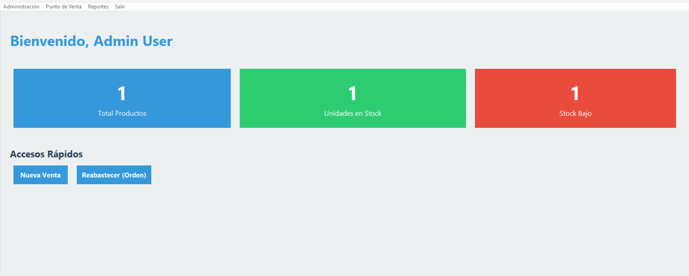

# Sistema de Ventas GUI App

[](https://github.com/Geovanni-Gonzalez/SistemaDeVentas--GUI-App/actions/workflows/ci.yml)

## Descripción
Sistema de ventas con interfaz Python/Tkinter para clientes, productos, categorias, proveedores, ordenes y facturas mediante archivos.

## Objetivo
Practicar aplicaciónes desktop CRUD, autenticación, reportes y persistencia local.

## Tecnologías utilizadas
- Python 3
- Tkinter
- Archivos .txt
- Repositorios/modelos

## Funcionalidades principales
- Login y menu
- CRUD comercial
- Facturacion y ordenes
- Búsqueda/reportes
- Capa repository

## Mi rol
Desarrollé interfaz, modelos, repositorios y flujos de ventas.

## Aprendizajes clave
- Desktop por ventanas
- Persistencia multi-entidad
- UI-modelo-repositorio
- Flujos administrativos

## Instalación y ejecución
```bash
cd SistemaDeVentas--GUI-App/programa
python main.py
```

## Estructura del proyecto
- main.py: entrada
- src/: lógica
- src/ui/: ventanas
- data/: entidades

## Capturas o demo


## Estado del proyecto
Proyecto académico funcional.

## Valor técnico demostrado
Demuestra sistemas administrativos con múltiples entidades y UI desktop.

## Mejoras futuras
- Migrar a SQLite
- Pruebas de repositorio
- Documentar credenciales

## Autor
Geovanni González  
Estudiante de Ingeniería en Computación  
GitHub: [Geovanni-Gonzalez](https://github.com/Geovanni-Gonzalez)


